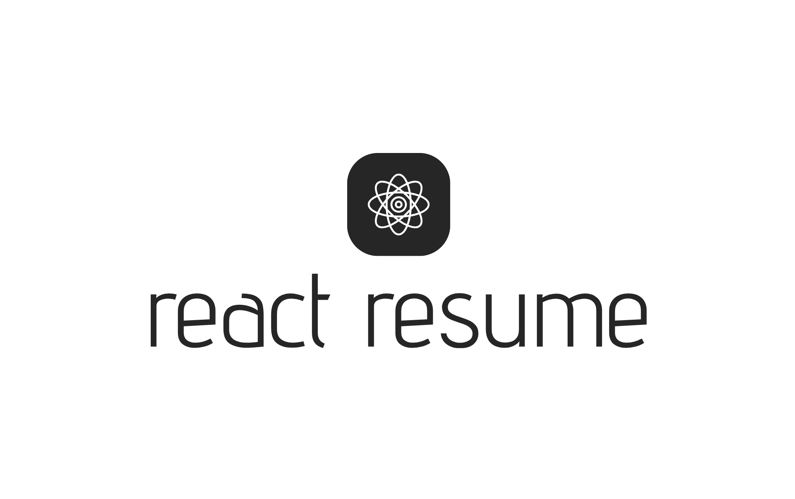

# React Resume

<picture>
  <source media="(prefers-color-scheme: dark)" srcset="./public/logo/grun.png">
  
</picture>

## Getting Started

1. Fill out the JSON files within the `data/` directory (see [Data Directory](#data-directory) below)
2. Edit `public/index.html` with the correct page `<title/>`.
3. Run `npm install` to install the requirements.
4. Run `npm run start` to start the development server.

## Features

### Highlighter

Within the [Data Directory](#data-directory), you'll find a file named `Highlighter.json`

This file contains a JSON list of terms that will be wrapped in a `<mark></mark>` HTML tag. 
Which will give that term, when matched, a highlighted look. It is case-insensitive and punctuation independent. 

The JSON looks as follows:

> ```json
> [
>   "node",
>   "nodejs",
>   "react",
>   "reactjs",
>   "javascript",
>   "typescript"
> ]
> ```

**THIS ONLY APPLIES TO `EXPERIENCE.RESPONSIBILITIES`**

### Hide Contact Info

**Scenario**: A recruiter or company wants a copy of your resume, but does not want the 
contact information to be shown. However, you don't want to modify your `Information.json` 
to change `display` to `false` only for this one instance. 

So what do you do? You append `?contact=hide` to the url, as follows:

> https://localhost:3000/?contact=hide

This will cause the contact information to be hidden dynamically. 

## Data Directory

#### Summary

> A brief summary of your professional profile. Keep it concise, ideally within 2 sentences.
>
> The JSON looks like this:
> 
> ```json
> ["Your summary goes here"]
> ```
> 

#### Skills

> A list of your skills. Include technical skills, languages, and soft skills.
> 
> The JSON looks like this:
> 
> ```json
> [
>     "JavaScript",
>     "Python",
>     "Go",
>     "PHP",
>     "SQL"
> ]
> ```
> 
> The number of columns is controlled in the config.json, but the app will automatically
> attempt to calculate the rows and columns, defaulting to 4 columns.
> 

#### Publications

> List of your publications, including articles, software, and other contributions.
> 
> The JSON looks like this:
> 
> ```json
> [
>   {
>       "name": "Optimizing Full-Stack Development for Scalability",
>       "description": "An in-depth guide on building scalable full-stack applications.",
>       "url": "https://example.com/optimizing-full-stack-development",
>       "display": true
>   }
> ]
> ```
> 
> The `display` option, as in other sections, controls whether that specific publication is 
> displayed or not.
> 

#### Information

> Your personal information. Include fields like name, title, location, email, and social media
profiles.
> 
> The JSON looks like this:
> 
> ```json
> {
>   "name": {
>       "first": "Johnny",
>       "middle": "B.",
>       "last": "Good"
>   },
>   "title": "Software Engineer",
>   "meta": {
>       "location": "Everytown, USA",
>       "phone": "+1 123 456 7890",
>       "email": {
>           "address": "example@example.com",
>           "link": false
>       },
>       "socials": [
>           "https://facebook.com/okok",
>           "https://twitter.com/okok",
>           "https://linkedin.com/in/okok"
>       ],
>       "display": true
>   }
> }
> ```
> 
> There are a few items here to discuss. Our `name` section is split into `first`, 
> `middle`, and `last`. Our professional title goes in `title`. Next, we have our `meta`
> section, which has quite a bit: 
>   - `location` should be in the format of: `province, state` or `state, country`
>   - `phone` should be in a friendly format, ideally internationally
>   - `email` is where our email goes (in `address`), and `link` is a boolean which dictates whether to create a `mailto:` link
>   - `socials` is a list of your social URLs
>   - `display` dictates whether to display the meta information, or not.
>

#### Experience 

> Your work experience. Specify details such as company name, type, location, job title, start
and end dates, and responsibilities. Pay attention to:
> - `meta.type`: Options include "full-time", "part-time", "contract", "internship", and "weekend"
> - `meta.remote`: Options include "remote", "hybrid", "on-site".
>
> The JSON looks like this:
> 
> ```json
> [
>   {
>       "company": {
>           "name": "Google",
>           "type": "Technology",
>           "location": "Mountain View, CA"
>       },
>       "meta": {
>           "display": true,
>           "class": "google",
>           "type": "full-time",
>           "remote": "remote"
>       },
>       "dates": {
>           "start": "2018-05-01",
>           "end": "Present"
>       },
>       "title": "Senior Software Engineer",
>       "responsibilities": "Led the development of scalable web applications"
>   }
> ]
> ```
> 
> There's quite a bit to go through here, so let's start:
> 
> - `company` details about the company you worked for
> - `company.name` is the name of the company
> - `company.type` is the industry the company operates in
> - `company.location` is simply the location of the company in the format "province, state" or "state, country"
> - `meta` contains meta information 
> - `meta.display` dictates whether to display this company
> - `meta.class` is a CSS class for you to target the company if you wish to change how it's displayed
> - `type` is the type of work, one of: [full-time, part-time, contract, internship, weekend]
>   - full-time: Full time work, usually more than 35 hours per week
>   - part-time: Part time work, usually max of 30 hours per week
>   - contract: Contract work, usually billed hourly or by project
>   - internship: Internship work, some sort of professional learning experience
>   - weekend: Weekend work, either a second job or startup you've created where you work separate from your main job
> - `dates` are the start and end dates of your employment with the company
> - `dates.start` your start date, in format YYYY-MM-DD
> - `dates.end` your end date, in format YYYY-MM-DD - or "present" or "Present"
> - `title` is your professional title at the role
> - `responsibilities` is where you define your responsibilities in the role/company

#### Education

> Your education history. Include degrees, schools, locations, dates, and any honors.
>
> The JSON looks like this:
> 
> ```json
> [
>   {
>     "degree": {
>       "short_name": "B.S in Computer Science",
>       "long_name": "Bachelor of Science in Computer Science, Summa Cum Laude | 3.95 GPA"
>     },
>     "school": {
>       "name": "MIT",
>       "location": "Cambridge, MA"
>     },
>     "dates": {
>       "showDate": true,
>       "start": "2002-09-01",
>       "end": "2006-06-01"
>     },
>     "meta": {
>       "display": true
>     }
>   }
> ]
> ```
> 
> Let's go through this: 
> - `degree.short_name`  is the degree short name
> - `degree.long_name` is the degree long name
> - `school.name` is the school name
> - `school.location` is the school location, in format "province, state" or "state, country"
> - `dates.showDate` dictates whether to display the date or not
> - `dates.start` is your start date, in format YYYY-MM-DD
> - `dates.end` is your graduation or completion date in format YYYY-MM-DD
> - `meta.display` dictates whether to display this education or not
>

#### At A Glance

> Key points summarizing your professional highlights.
>
> The JSON looks like this:
> 
> ```json
> [
>   "15 years of professional experience as a software engineer",
>   "Proficient in multiple programming languages and frameworks"
> ]
> ```
> 
> Fairly self-explanatory, it's a list of at a glance quick bits of information about yourself
> >

#### Achievements

> Notable achievements throughout your career.
>
> The JSON looks like this:
> 
> ```json
> [
>   {
>     "name": "Published Author of Multiple Technical Articles",
>     "description": "Authored several well-received articles",
>     "year": "2010",
>     "meta": {
>       "display": true
>     }
>   }
> ]
> ```
> 
> `name` is the name of the achievement
> `description` is the longer description of the achievement
> `year` is the year you received or created this achievement
> `meta.display` dictates whether to display this achievement
> 

## Example Render


## Running Prettier

Prettier is set up to run on git commit.

## Available Scripts

In the project directory, you can run:

### `npm start`

Runs the app in the development mode.\
Open [http://localhost:3000](http://localhost:3000) to view it in your browser.

The page will reload when you make changes.\
You may also see any lint errors in the console.

### `npm test`

Launches the test runner in the interactive watch mode.\
See the section about [running tests](https://facebook.github.io/create-react-app/docs/running-tests) for more
information.

### `npm run build`

Builds the app for production to the `build` folder.\
It correctly bundles React in production mode and optimizes the build for the best performance.

The build is minified and the filenames include the hashes.\
Your app is ready to be deployed!

See the section about [deployment](https://facebook.github.io/create-react-app/docs/deployment) for more information.

### `npm run eject`

**Note: this is a one-way operation. Once you `eject`, you can't go back!**

If you aren't satisfied with the build tool and configuration choices, you can `eject` at any time. This command will
remove the single build dependency from your project.

Instead, it will copy all the configuration files and the transitive dependencies (webpack, Babel, ESLint, etc.) right
into your project, so you have full control over them. All the commands except `eject` will still work, but they will
point to the copied scripts, so you can tweak them. At this point you're on your own.

You don't have to ever use `eject`. The curated feature set is suitable for small and middle deployments, and you
shouldn't feel obligated to use this feature. However, we understand that this tool wouldn't be useful if you could not
customize it when you are ready for it.